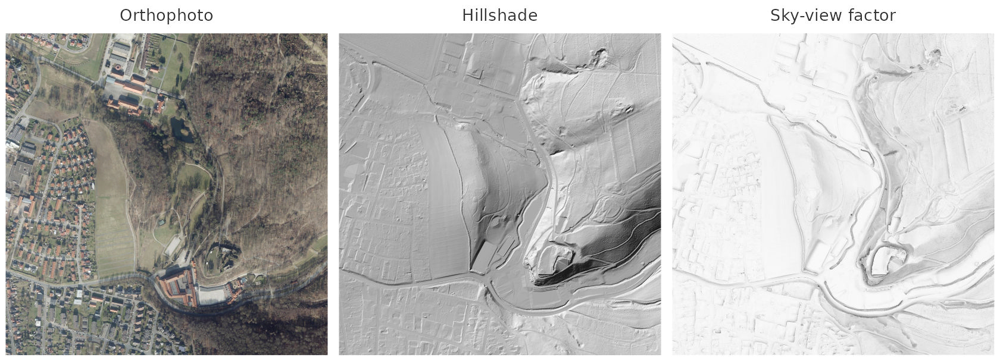
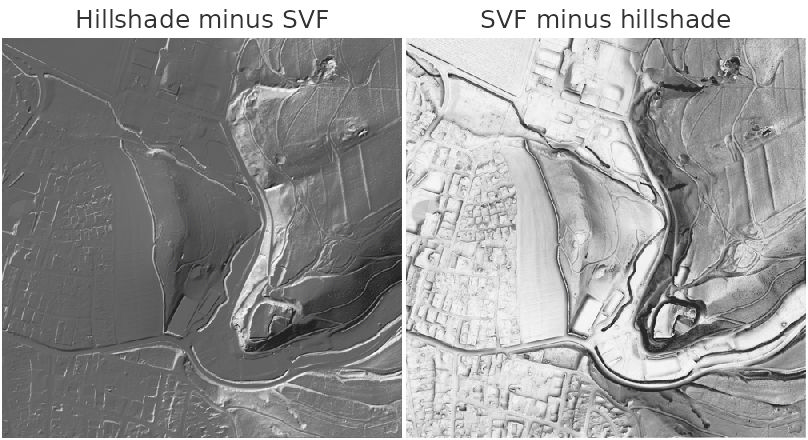
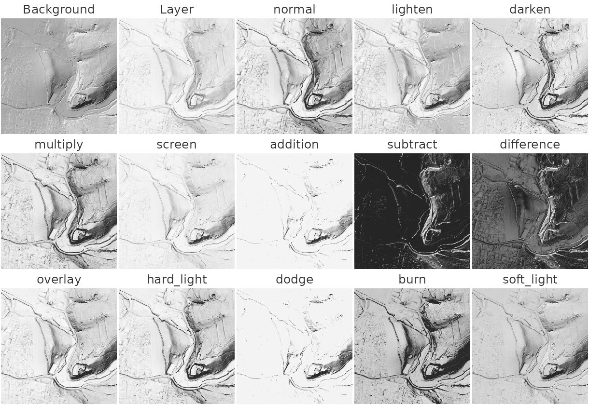
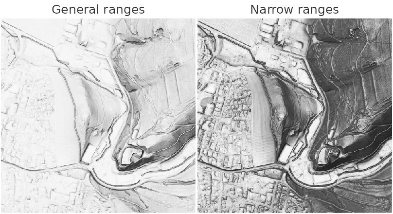
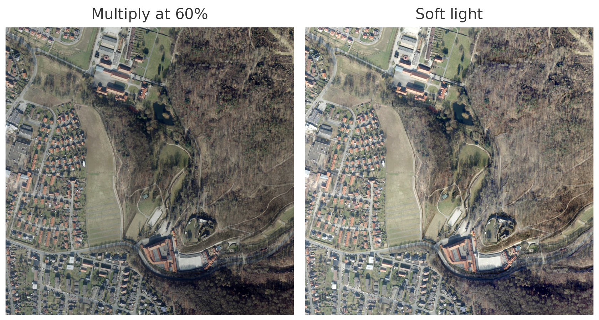
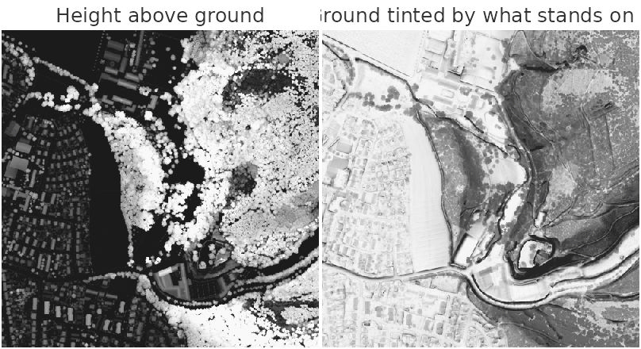
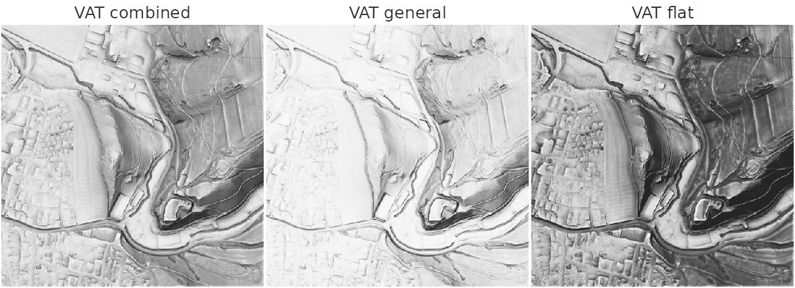
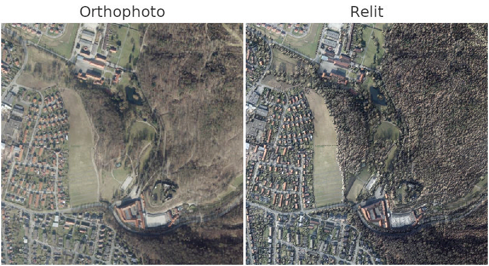
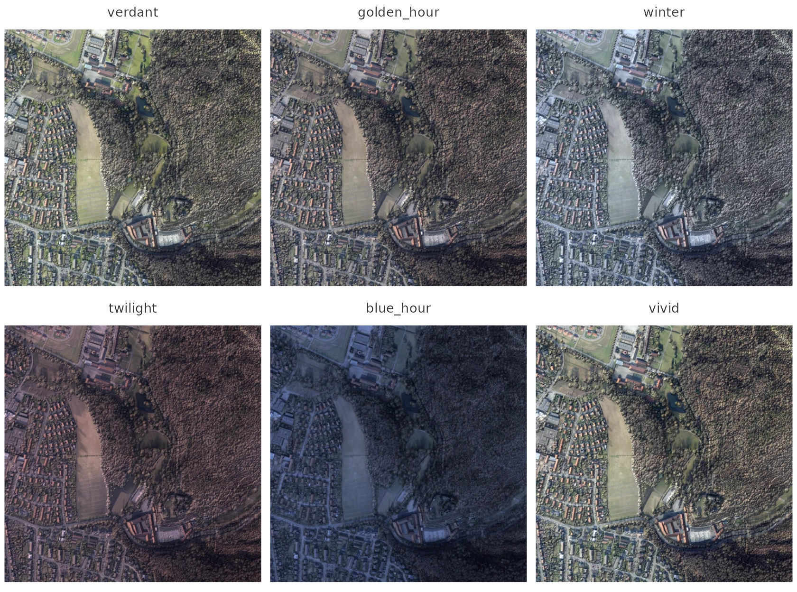
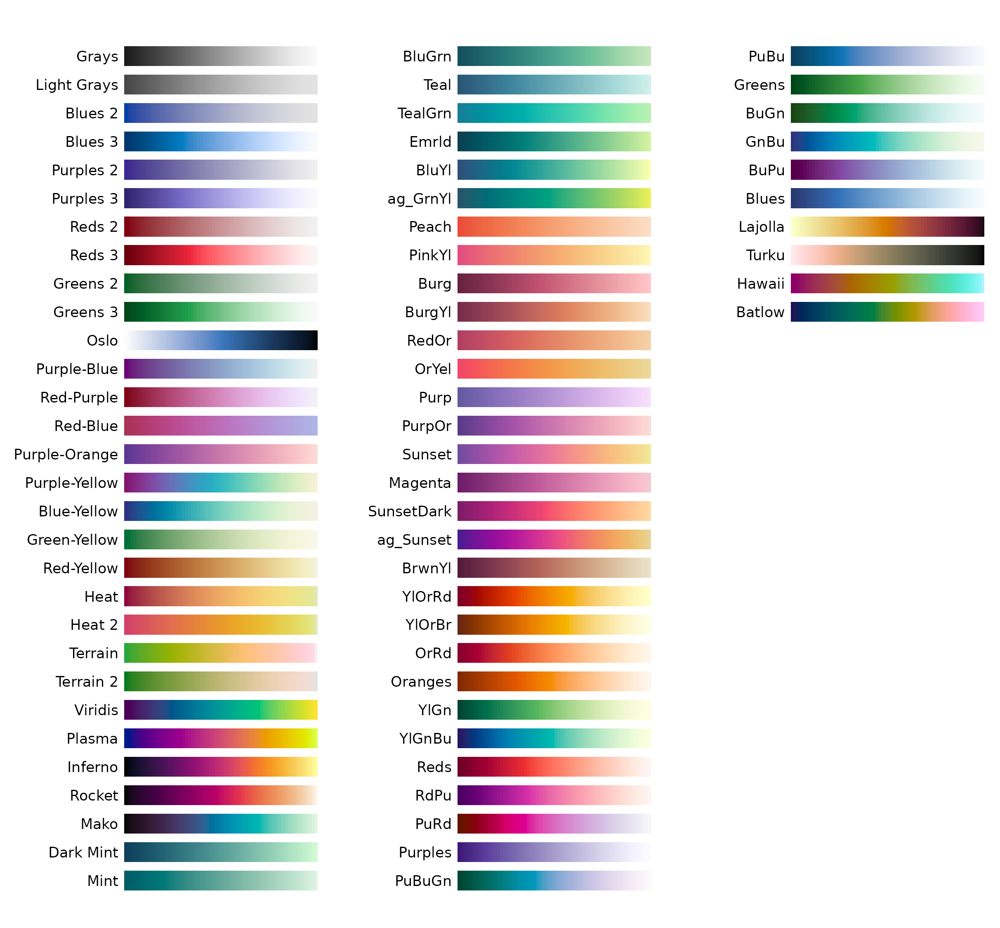

# Blending visualizations

No single visualization shows everything about a landscape. A hillshade
gives the eye a familiar sense of relief but hides whatever runs
parallel to its light. A sky-view factor shows enclosed ground but
flattens slopes. An orthophoto shows what is there, but not the shape of
the ground beneath it. The usual answer is to lay several of them over
one another, and
[`rvt_blend()`](https://wiesehahn.github.io/rvtr/reference/rvt_blend.md)
does that with the same blend modes a GIS offers.

This vignette explains how a blend is built, shows all thirteen modes
side by side, works through three composites, covers the ready-made
composite the package provides, and ends by relighting an orthophoto
with its terrain.

## The sample data

[`rvt_data_lgln()`](https://wiesehahn.github.io/rvtr/reference/rvt_data_lgln.md)
reads open data for any place in Lower Saxony, streamed from the state
survey authority. A point returns the 1 km tile it lies in; here, the
tile beside Burg Hardenberg: farmland, woodland, a castle on its spur
and a village. Three products are used: the orthophoto, fetched at 1 m
so it lies on the terrain grid; the terrain model, the bare ground; and
the surface model, the ground with trees and buildings on it. The [data
vignette](https://wiesehahn.github.io/rvtr/articles/data.md) covers
fetching data in detail.

Below, both elevation models are shown with the anisotropic sky-view
factor
([`rvt_asvf()`](https://wiesehahn.github.io/rvtr/reference/rvt_asvf.md)),
which gives a sense of light from the north-west while hiding nothing in
shadow. The terrain model reveals the castle’s spur, the slopes and
straight lines running beneath the forest; the surface model shows the
tree crowns and houses that cover them.

``` r

pt  <- c(9.9464, 51.6317)                              # longitude, latitude
rgb <- rvt_data_lgln(pt, "rgb", year = 2025, res = 1)  # orthophoto at 1 m
dtm <- rvt_data_lgln(pt, "dtm")                        # terrain: the bare ground
dsm <- rvt_data_lgln(pt, "dsm")                        # surface: trees and buildings

rvt_plot(rgb, main = "Orthophoto", max_dim = 400)
rvt_asvf(dtm, reach = 10) |> rvt_plot(main = "Terrain model", max_dim = 400,
                                      minmax_def = c(0.7, 1))
rvt_asvf(dsm, reach = 10) |> rvt_plot(main = "Surface model", max_dim = 400,
                                      minmax_def = c(0.4, 1))
```



Data: © GeoBasis-DE/LGLN 2026, CC BY 4.0, Daten geändert.

Each layer is downloaded the first time it is requested and read from a
local cache afterwards. The blends below start from two views of the
terrain model, computed once:

``` r

hs  <- rvt_hillshade(dtm)
svf <- rvt_svf(dtm, reach = 10)
```

## How a blend is built

### The raster you pipe in is the background

[`rvt_blend()`](https://wiesehahn.github.io/rvtr/reference/rvt_blend.md)
lays the raster passed as its argument *over* the raster piped into it.
A chain therefore reads from the bottom up, the way a GIS layer panel
does:

``` r

stack <- hs |>
  rvt_blend(svf, "multiply", opacity = 0.5, range = c(0.7, 1))
```

Order matters, because several modes treat their two inputs differently.
`subtract` removes the layer from the background, so swapping the two
gives a very different picture:

``` r

hs |>
  rvt_blend(svf, "subtract", opacity = 0.5, range = c(0.7, 1)) |>
  rvt_plot(main = "Hillshade minus SVF", max_dim = 400)
rvt_stack(svf, range = c(0.7, 1)) |>
  rvt_blend(hs, "subtract", opacity = 0.5) |>
  rvt_plot(main = "SVF minus hillshade", max_dim = 400)
```



Both are drawn at half opacity. At full strength the left image would be
almost entirely black, because the stretched sky-view factor (SVF) is
brighter than the hillshade over nearly the whole tile, and a
subtraction cannot go below black.

`overlay`, `hard_light`, `dodge` and `burn` depend on order as well,
although often less visibly. `overlay`, for instance, only changes when
the layers are swapped where one of them is darker than mid-grey and the
other lighter.

### Nothing is computed until you render

[`rvt_blend()`](https://wiesehahn.github.io/rvtr/reference/rvt_blend.md)
returns a recipe, not a raster. Printing it lists the layers from the
bottom up:

``` r

stack
#> <rvt_stack> 2 layers, bottom to top
#>   1. file26aa151adfc2.tif         (background) opacity 1.00  range auto
#>   2. file26aa607da91a.tif         multiply    opacity 0.50  range 0.7-1
#> Renders at 1000 x 1000, 1 m. Not a raster yet - call rvt_render() to write it.
```

However long the chain, the layers are read and blended in a single pass
when the result is needed.
[`rvt_plot()`](https://wiesehahn.github.io/rvtr/reference/rvt_plot.md)
draws a stack directly, and
[`rvt_render()`](https://wiesehahn.github.io/rvtr/reference/rvt_render.md)
writes it to a file:

``` r

rvt_render(stack, "relief.tif")
```

Computing the metrics is the expensive part of any composite; blending
them is cheap. Because each metric is computed once and kept, trying
another mode or opacity takes seconds.

### Every layer is stretched first

Before blending, each layer is stretched to the range 0 to 1. By default
the stretch runs from the raster’s own minimum to its maximum, which
often wastes contrast. A sky-view factor can in principle take any value
from 0 to 1, but on ordinary terrain almost all of it lies near the top.
`range` focuses the stretch on the values that actually occur, and
[`rvt_range()`](https://wiesehahn.github.io/rvtr/reference/rvt_range.md)
reads a percentile range from the raster:

``` r

rvt_range(svf)
#> [1] 0.3161525 1.0156794
rvt_range(svf, pct = c(2, 98))
#> [1] 0.7233978 0.9935465
```

The range is fixed before any part of the raster is read for blending,
so the result does not depend on how the raster is divided into tiles.
`invert = TRUE` flips a layer after stretching, the usual way to show
slope.

### Opacity is applied last

The mode combines the layer with what lies beneath it, and `opacity`
then fades that result back towards the background. At `opacity = 0` the
layer has no effect; at `1` the mode applies at full strength.

## All thirteen modes

Every mode below is applied to the same two layers: the hillshade as the
background, and the sky-view factor over it at full opacity.

``` r

rvt_plot(hs,  main = "Background", max_dim = 240)
rvt_plot(svf, main = "Layer", max_dim = 240)
for (mode in rvt_blend_modes) {
  hs |>
    rvt_blend(svf, mode, range = c(0.7, 1)) |>
    rvt_plot(main = mode, max_dim = 240)
}
```



| Mode | What it does | Use it for |
|----|----|----|
| `normal` | The layer replaces the background | Fading one view into another with `opacity` |
| `multiply` | Darkens by the layer, never lightens | Deepening enclosed ground with a sky-view factor |
| `screen` | Lightens by the layer, never darkens | Lifting ridges, or brightening a dark base |
| `overlay` | Darkens the dark and lightens the light parts of the background | Adding contrast without washing the image out |
| `soft_light` | A gentler `overlay` | Subtle contrast, or relief over an orthophoto |
| `hard_light` | `overlay`, but driven by the layer | Letting the layer’s contrast dominate |
| `darken` | Keeps the darker of the two | Combining the shadows of two views |
| `lighten` | Keeps the lighter of the two | Combining the highlights of two views |
| `difference` | The absolute difference | Showing where two views disagree |
| `subtract` | Background minus layer, limited at black | Removing one view’s brightness from another |
| `addition` | The sum, limited at white | Brightening quickly; clips easily |
| `dodge` | Brightens the background by the layer | Strong highlights; clips easily |
| `burn` | Darkens the background by the layer | Strong shadows; clips easily |

In practice, three of these cover most composites: `multiply`, `screen`
and `overlay`.

## Recipes

### A relief stack from terrain metrics

This stack combines four views of the terrain. The hillshade gives the
basic impression of relief, inverted slope sharpens breaks of slope,
positive openness blended with `overlay` lifts convex features, and the
sky-view factor multiplied in darkens enclosed ground.

``` r

slp  <- rvt_slope(dtm)
opns <- rvt_openness(dtm, reach = 10)

relief <- function(slope_range, openness_range, svf_range) {
  rvt_stack(hs, range = c(0, 1)) |>
    rvt_blend(slp,  "normal",   opacity = 0.5,  range = slope_range, invert = TRUE) |>
    rvt_blend(opns, "overlay",  opacity = 0.5,  range = openness_range) |>
    rvt_blend(svf,  "multiply", opacity = 0.25, range = svf_range)
}

relief(c(0, 50), c(68, 93), c(0.7, 1)) |> rvt_plot(main = "General ranges", max_dim = 400)
relief(c(0, 15), c(85, 93), c(0.9, 1)) |> rvt_plot(main = "Narrow ranges", max_dim = 400)
```



The left image uses the layers, modes and ranges of the general-terrain
half of
[`rvt_vat()`](https://wiesehahn.github.io/rvtr/reference/rvt_vat.md).
Those ranges suit rugged ground, and on this gently rolling tile they
leave the picture pale. The right image narrows them to the flat-terrain
values, which spends the contrast on the gentle slopes that actually
occur here. Written out as a stack, every layer, mode and range can be
changed individually.

### An orthophoto with shaded relief

Laying terrain over imagery shows colour and shape together. `multiply`
only darkens, so slopes facing away from the light become darker while
sunlit ones keep the photo’s own brightness. `soft_light` works in both
directions, darkening shaded slopes and lightening sunlit ones.

``` r

rgb |> rvt_blend(hs, "multiply", opacity = 0.6) |> rvt_plot(main = "Multiply at 60%", max_dim = 400)
rgb |> rvt_blend(hs, "soft_light") |> rvt_plot(main = "Soft light", max_dim = 400)
```



A single-band layer is applied to each of the orthophoto’s three colour
bands. The two can be blended directly because, fetched at 1 m, the
orthophoto lies on exactly the terrain grid.

### Terrain and surface together

The terrain model shows the ground and the surface model what stands on
it, and two blends show both at once.

The first finds the height of everything above the ground. Stretching
both elevation models over the same range, here 300 m, and subtracting
the terrain from the surface leaves exactly that height, as a share of
the range: 0.1 is 30 m. Rendered to a raster, it shows the forest, the
houses and the single trees along the field, while open ground stays
black.

The second uses that raster as a layer. Inverted and multiplied over the
anisotropic sky-view factor of the terrain, it lays a grey tint wherever
something stands, darker the taller it is. The shape of the ground stays
sharp underneath, so the castle’s spur, the slopes and the lines beneath
the forest remain as readable as in the terrain model alone.

``` r

same <- c(120, 420)                             # one range for both models
height <- rvt_stack(dsm, range = same) |>
  rvt_blend(dtm, "subtract", range = same) |>
  rvt_render()
rvt_plot(height, main = "Height above ground", max_dim = 400, minmax_def = c(0, 0.1))

rvt_stack(rvt_asvf(dtm, reach = 10), range = c(0.7, 1)) |>
  rvt_blend(height, "multiply", opacity = 0.6, range = c(0, 0.1), invert = TRUE) |>
  rvt_plot(main = "Ground tinted by what stands on it", max_dim = 400)
```



## Ready-made composites

[`rvt_vat()`](https://wiesehahn.github.io/rvtr/reference/rvt_vat.md) is
a composite that needs no assembling: the Visualization for
Archaeological Topography of Kokalj and Somrak. It builds the four-layer
relief stack from the recipe above twice, once with settings for
ordinary relief and once tuned for flat ground, and averages the two, so
a single call works across mixed terrain. Passing the same preset twice
renders one terrain type alone.

``` r

general <- list(rvt_preset_general, rvt_preset_general)
flat    <- list(rvt_preset_flat, rvt_preset_flat)

rvt_vat(dtm) |> rvt_plot(main = "VAT combined", max_dim = 400)
rvt_vat(dtm, presets = general) |> rvt_plot(main = "VAT general", max_dim = 400)
rvt_vat(dtm, presets = flat) |> rvt_plot(main = "VAT flat", max_dim = 400)
```



The two presets differ in more than their stretch ranges. The
flat-terrain version also lowers the sun from 35 to 15 degrees, searches
twice as far for openness and sky-view factor, and removes more noise.
Both presets are ordinary lists, so a variant is one
[`modifyList()`](https://rdrr.io/r/utils/modifyList.html) away:

``` r

wider <- modifyList(rvt_preset_general, list(reach = 20))
rvt_vat(dtm, presets = list(wider, rvt_preset_flat))
```

A ready-made composite is the quick route. When a layer needs to change
in a way the presets do not expose, write the stack out with
[`rvt_blend()`](https://wiesehahn.github.io/rvtr/reference/rvt_blend.md),
as in the relief recipe above.

## Relighting an orthophoto

Blending lays shading over a photo.
[`rvt_relight()`](https://wiesehahn.github.io/rvtr/reference/rvt_relight.md)
goes a step further and lights the photo with the terrain beneath it,
the way a rendered landscape model is lit: a warm sun on slopes that
face it, soft cast shadows, and cool sky light that gives the shadows a
slight blue cast. Using the surface model lets trees and buildings cast
shadows too.

The result is darker than the photo wherever something casts a shadow.
On this tile, where trees and buildings cover more than half the ground,
the whole image comes out at about two thirds of the photo’s brightness,
while sunlit open ground keeps nearly all of it.

``` r

true_colour <- c(0, 0, 0, 255, 255, 255)

rvt_plot(rgb, main = "Orthophoto", minmax_def = true_colour, max_dim = 400)
rvt_relight(rgb, dsm) |> rvt_plot(main = "Relit", minmax_def = true_colour, max_dim = 400)
```



The lighting comes in named styles, listed in `rvt_relight_styles`. Any
setting passed directly overrides the style, so
`rvt_relight(rgb, dsm, style = "winter", sun_elevation = 10)` gives a
winter light with an even lower sun.

``` r

styles <- c("verdant", "golden_hour", "winter",
            "twilight", "blue_hour", "vivid")

for (style in styles) {
  rvt_relight(rgb, dsm, style = style) |>
    rvt_plot(main = style, minmax_def = true_colour, max_dim = 400)
}
```



## Choosing colours

[`rvt_plot()`](https://wiesehahn.github.io/rvtr/reference/rvt_plot.md)
takes a palette name as its second argument, as in
`rvt_plot(svf, "Viridis")`.
[`rvt_palettes()`](https://wiesehahn.github.io/rvtr/reference/rvt_palettes.md)
draws every available palette, so you can choose one by eye:

``` r

rvt_palettes("sequential")
```


