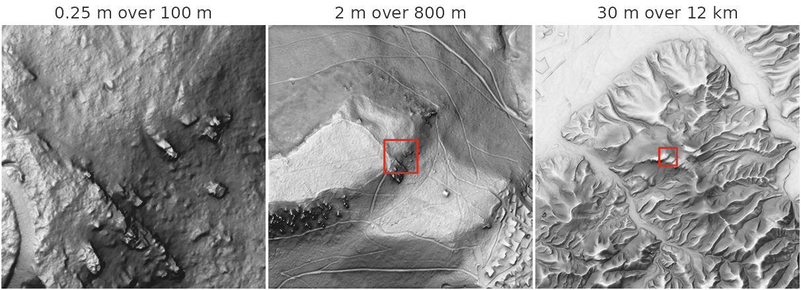
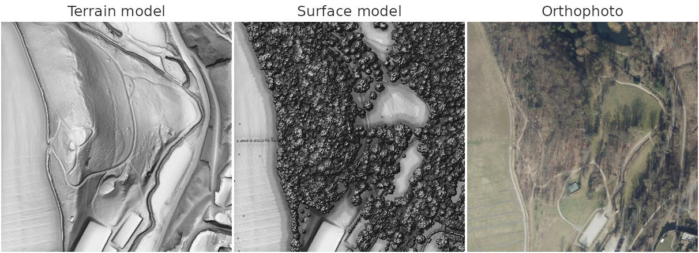
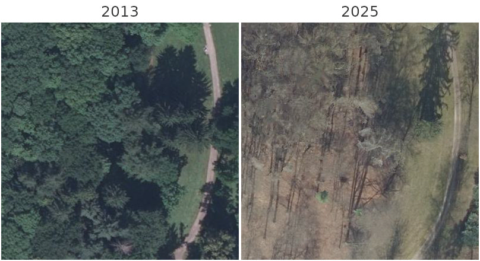
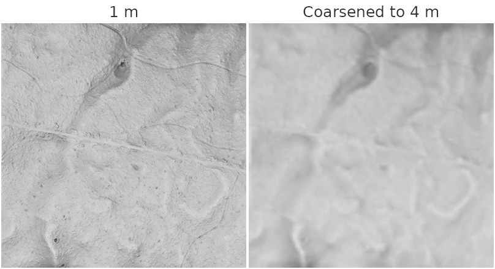

# Getting data

Every function in this package takes the path to an elevation raster, so
any terrain model you already have works. Two functions fetch one for
you:
[`rvt_data_mapterhorn()`](https://wiesehahn.github.io/rvtr/reference/rvt_data_mapterhorn.md)
for anywhere in the world, and
[`rvt_data_lgln()`](https://wiesehahn.github.io/rvtr/reference/rvt_data_lgln.md)
for Lower Saxony, where it also offers a surface model and orthophotos.
Neither downloads anything until the data is read, and then only the
part that is needed.

Distances in this package are in metres, never pixels. Both functions
therefore return data in a coordinate system measured in metres, and
your own data needs one too.

## Terrain for anywhere: `rvt_data_mapterhorn()`

[Mapterhorn](https://mapterhorn.com) combines open elevation data into
one global dataset. The 30 m Copernicus model covers the whole world,
and national LiDAR terrain models take over where they have been
published: 1 m across Germany, Austria and Norway, 0.5 m in Switzerland,
0.25 m in parts of Baden-Württemberg, and many more.

Give a point, and you get a square around it, `size` metres across. Give
an extent, and you get exactly that area. Here is one place, the Battert
crags above Baden-Baden, at three scales, each shown with
[`rvt_vat()`](https://wiesehahn.github.io/rvtr/reference/rvt_vat.md).
Each panel is 400 × 400 pixels, and each outline marks the area of the
panel before it.

``` r

battert <- c(8.2618, 48.7788)                            # longitude, latitude

fine   <- rvt_data_mapterhorn(battert, size = 100)            # finest: 0.25 m
medium <- rvt_data_mapterhorn(battert, size = 800,   res = 2)
coarse <- rvt_data_mapterhorn(battert, size = 12000, res = 30)

# VAT searches 10 and 20 m around each cell, less than one 30 m cell,
# so the coarse panel searches further
wide <- list(modifyList(rvt_preset_general, list(reach = 300)),
             modifyList(rvt_preset_flat,    list(reach = 600)))

outline <- function(inner) {                             # the area of `inner`
  b <- methods::new(gdalraster::GDALRaster, inner)$bbox()
  rect(b[1], b[2], b[3], b[4], border = "#d7301f", lwd = 2)
}

rvt_vat(fine) |> rvt_plot(main = "0.25 m over 100 m", max_dim = 400)
rvt_vat(medium) |> rvt_plot(main = "2 m over 800 m", max_dim = 400)
outline(fine)
rvt_vat(coarse, presets = wide) |> rvt_plot(main = "30 m over 12 km", max_dim = 400)
outline(medium)
```



At 0.25 m single sandstone blocks stand out on the forested slope. At 2
m the line of crags appears along the ridge, with forest roads and skid
trails winding around it, and at 30 m the ridge is one of many among the
valleys at the western edge of the Black Forest.

### Which data covers a place

[`rvt_data_mapterhorn_sources()`](https://wiesehahn.github.io/rvtr/reference/rvt_data_mapterhorn_sources.md)
lists the sources available for an area, finest first, without fetching
any elevation data:

``` r

rvt_data_mapterhorn_sources(battert)[, c("source", "resolution", "license")]
#>    source resolution                                               license
#> 1 debw025       0.25 Datenlizenz Deutschland - Namensnennung - Version 2.0
#> 2    debw       1.00 Datenlizenz Deutschland - Namensnennung - Version 2.0
#> 3   glo30      30.00                COPERNICUS full, free and open license
```

### Resolution

Without `res`, you get the finest source available. A larger `res`
coarsens the data, and a smaller one is refused, because the result
could only be interpolated:

``` r

rvt_data_mapterhorn(battert, size = 100, res = 0.1)
#> Error:
#> ! The finest Mapterhorn data here is 0.25 m (Baden-Württemberg DGM ALS_3), so `res = 0.1` would only interpolate. Use res >= 0.25.
```

Where an area crosses the edge of a detailed survey, the coarser data
fills in wherever the finer data stops, so the result has no holes.

### Coordinate system

Mapterhorn stores its tiles in Web Mercator, whose map units are
stretched by 1/cos(latitude), 1.6 times at 51 degrees north. That would
break every distance in this package, so the data is always reprojected:
by default to the UTM zone of the area’s centre, or to any coordinate
system in metres you pass as `crs`. Use the national system when the
data has to line up with other rasters, for example `crs = 25832` in
Germany.

``` r

gdalraster::srs_find_epsg(methods::new(gdalraster::GDALRaster, fine)$getProjection())
#> [1] "EPSG:32632"
```

### Credit

The data comes from many producers, each under its own open licence. The
sources used are printed the first time each is fetched in a session,
and <https://mapterhorn.com/attribution> lists the full terms.

## Lower Saxony in detail: `rvt_data_lgln()`

The state survey authority of Lower Saxony (LGLN) publishes four
products for the whole state, and
[`rvt_data_lgln()`](https://wiesehahn.github.io/rvtr/reference/rvt_data_lgln.md)
reads all of them:

| product | what | native grid |
|----|----|----|
| `"dtm"` | terrain model, the bare ground | 1 m |
| `"dsm"` | surface model from lidar, ground plus trees and buildings | 1 m |
| `"bdom"` | surface model matched from the aerial photos | 0.2 m |
| `"rgb"` | orthophoto | 0.2 m |

The two surface models are not interchangeable. `"bdom"` is five times
finer and draws roofs, walls and open ground far more crisply, but it is
computed by matching texture between overlapping photographs, so over
woodland it depends on when the photographs were taken. A canopy in leaf
is captured well; a bare broadleaf canopy offers little to match, and
the result can settle on the forest floor instead — smoothly and
plausibly, so it looks like a terrain model rather than like an error.
Check the flight dates with
[`rvt_data_lgln_years()`](https://wiesehahn.github.io/rvtr/reference/rvt_data_lgln_years.md),
and use the lidar `"dsm"` where canopy matters regardless of season.

The data comes in the survey’s own coordinate system, ETRS89 / UTM zone
32N (EPSG:25832), and is never reprojected. A point returns the 1 km
tile it lies in; an extent, here a 400 m square in EPSG:25832, returns
exactly that area. Fetching the orthophoto at `res = 1` puts it on the
same grid as the terrain, so the three line up cell for cell.

``` r

area <- sf::st_bbox(c(xmin = 565300, ymin = 5720300, xmax = 565700, ymax = 5720700),
                    crs = 25832)                         # beside Burg Hardenberg

dtm <- rvt_data_lgln(area, "dtm")
dsm <- rvt_data_lgln(area, "dsm")
rgb <- rvt_data_lgln(area, "rgb", year = 2025, res = 1)

rvt_vat(dtm) |> rvt_plot(main = "Terrain model", max_dim = 400)
rvt_vat(dsm) |> rvt_plot(main = "Surface model", max_dim = 400)
rvt_plot(rgb, main = "Orthophoto", max_dim = 400,
         range = c(0, 255))
```



The terrain model shows the shape of the ground, even beneath the
forest; the surface model adds the tree crowns and buildings standing on
it.

### Flight years

The terrain and surface models usually exist for one year, but
orthophotos are flown every few years.
[`rvt_data_lgln_years()`](https://wiesehahn.github.io/rvtr/reference/rvt_data_lgln_years.md)
lists them without fetching any data:

``` r

rvt_data_lgln_years(area, "rgb")
#>   product year first_date  last_date tiles coverage covers
#> 1     rgb 2013 2013-06-18 2013-06-18     1        1   TRUE
#> 2     rgb 2016 2016-03-17 2016-03-17     1        1   TRUE
#> 3     rgb 2019 2019-04-01 2019-04-01     1        1   TRUE
#> 4     rgb 2022 2022-03-13 2022-03-13     1        1   TRUE
#> 5     rgb 2025 2025-03-08 2025-03-08     1        1   TRUE
```

A year is flown over only part of the state, so `coverage` says how much
of your area each one reaches. Without `year`, every tile takes its own
latest flight, which gives both the newest data and the widest coverage
— several years at once where that is what it takes to fill the area.
Naming a `year` uses that one survey throughout, with NoData wherever it
was not flown. The comparison below is an 80 m square at the
orthophoto’s native 0.2 m, so each panel shows its own 400 × 400 pixels.
Flights happen in different seasons: 2013 was flown in June, with the
trees in leaf, and 2025 in March, without.

``` r

detail <- sf::st_bbox(c(xmin = 565460, ymin = 5720460, xmax = 565540, ymax = 5720540),
                      crs = 25832)

for (year in c(2013, 2025)) {
  rvt_data_lgln(detail, "rgb", year = year) |>
    rvt_plot(main = year, max_dim = 400, range = c(0, 255))
}
```



### Credit

LGLN’s data is licensed CC BY 4.0. Credit it as © GeoBasis-DE/LGLN
followed by the year you downloaded it, and add “Daten geändert” (data
modified) for anything derived from it, which includes every result of
this package.

## Streaming and downloading

Both functions return the path to a small virtual raster by default. It
points at the remote files, and data moves only when something reads it,
so asking for an area costs nothing until you compute on it.

With `download = TRUE` a Cloud-Optimized GeoTIFF is stored in your user
cache instead, and later calls for the same area are served from there.
Use `refresh = TRUE` to fetch it again.

``` r

dtm <- rvt_data_mapterhorn(battert, size = 2000, download = TRUE)
tools::R_user_dir("rvtr", "cache")                       # where it is kept
```

Download first when you will compute several metrics over a large area.
Each metric reads the data in many small windows, and over the network
that is far slower than reading a local file.

Before anything is read, both functions estimate the download and stop
above `max_mb`, 500 MB by default:

``` r

rvt_data_mapterhorn(c(8.5, 48.2, 9.5, 48.6))             # 75 x 45 km at 0.25 m
#> Error:
#> ! Reading this area would fetch about 345,694 Mapterhorn tiles, an estimated 51854 MB, above `max_mb = 500`. Reduce the area, use a coarser `res`, or raise `max_mb` if you mean it.
```

## Your own data

Any raster GDAL can read works, as long as its coordinate system is
measured in metres. A terra `SpatRaster` can be passed instead of a
path: one read from a file is used as it lies, and one terra computed in
memory is written to a temporary GeoTIFF first. Reproject a raster in
degrees before using it:

``` r

gdalraster::warp("dem_wgs84.tif", "dem_utm.tif", t_srs = "EPSG:25832")
```

Terrain often comes as many tiles. Pass them all at once; they are read
as one seamless raster, so results show no edges at the tile boundaries:

``` r

tiles <- list.files("dtm_tiles", "\\.tif$", full.names = TRUE)
tiles |> rvt_svf("svf.tif")
```

[`rvt_fill()`](https://wiesehahn.github.io/rvtr/reference/rvt_fill.md)
interpolates across holes in the data. Fill before computing anything:
slope and curvature lose a ring of cells around every hole, and the
horizon-based metrics see straight through one.

[`rvt_resample()`](https://wiesehahn.github.io/rvtr/reference/rvt_resample.md)
coarsens a raster, to study terrain at a broader scale or to make a
large area affordable. It refuses to make a raster finer, since that
could only interpolate. Here part of the bundled sample tile is shown at
its own 1 m and coarsened to 4 m, where the small bumps and faint paths
disappear:

``` r

dem <- system.file("extdata", "dtm1.tif", package = "rvtr")
part <- tempfile(fileext = ".tif")
gdalraster::translate(dem, part, cl_arg = c("-srcwin", 300, 300, 400, 400), quiet = TRUE)

rvt_vat(part) |> rvt_plot(main = "1 m", max_dim = 400, range = c(0, 1))
rvt_resample(part, 4) |> rvt_vat() |>
  rvt_plot(main = "Coarsened to 4 m", max_dim = 400, range = c(0, 1))
#> `reach`: 10 snapped to 3 cells = 12 (cell size 4)
```


