# Visualizations and metrics

This vignette shows every visualization and metric in the package on the
same ground, so they can be compared directly. Each function takes the
path to a terrain model and writes a raster, and every distance it takes
is in metres. The short descriptions here are a starting point; each
help page explains how the method works, how to tune it, and which
settings suit which terrain, and
[`?rvtr`](https://wiesehahn.github.io/rvtr/reference/rvtr-package.md)
summarises which to use where.

The terrain is a 400 m square of the Hünstollen at 1 m, from the terrain
model of Lower Saxony. A steep, curving edge drops from a field on
higher ground in the south-west, crossed by ditches, to lower and uneven
ground in the east, and tracks run across the slopes. The area is
wooded, but a terrain model shows the bare ground beneath the trees. For
the landscape around it, a 4 km square centred on the same place is
fetched at 10 m, which also gives 400 × 400 cells. Both are downloaded
once, since every figure below reads them:

``` r

area <- sf::st_bbox(c(xmin = 572492, ymin = 5714542, xmax = 572892, ymax = 5714942),
                    crs = 25832)
dem <- rvt_data_lgln(area, "dtm", download = TRUE)

landscape_area <- sf::st_bbox(c(xmin = 570690, ymin = 5712740,
                                xmax = 574690, ymax = 5716740), crs = 25832)
landscape <- rvt_data_lgln(landscape_area, "dtm", res = 10, download = TRUE)

outline <- function() {                     # the 400 m square, on a landscape map
  rect(area[["xmin"]], area[["ymin"]], area[["xmax"]], area[["ymax"]], lwd = 2)
}
```

Each figure’s code shows the palette and stretch used, as a starting
point for your own. The panels are 400 × 400 pixels: one pixel per metre
for the 400 m square, one per 10 m for the landscape.

## Shading and sun

[`rvt_hillshade()`](https://wiesehahn.github.io/rvtr/reference/rvt_hillshade.md)
lights the terrain from one direction and is the most familiar picture
of relief. Anything running parallel to the light fades out, and slopes
facing away from it turn dark.
[`rvt_multi_hillshade()`](https://wiesehahn.github.io/rvtr/reference/rvt_multi_hillshade.md)
lights from four directions at once, so less is hidden and no side is
left in deep shadow.
[`rvt_shadow()`](https://wiesehahn.github.io/rvtr/reference/rvt_shadow.md)
shows true cast shadow for one sun position: white where the sun
reaches, black where terrain blocks it.

All three light the terrain from the north-west by default, here with
the sun 25 degrees high for the shadow. The sun never stands there in
Central Europe; the north-west is a display convention, because relief
lit from the top of the image reads correctly, while light from below
makes hills look like hollows.

``` r

rvt_hillshade(dem) |> rvt_plot(main = "rvt_hillshade()", max_dim = 400)
rvt_multi_hillshade(dem) |> rvt_plot(main = "rvt_multi_hillshade()", max_dim = 400)
rvt_shadow(dem, sun_elevation = 25) |> rvt_plot(main = "rvt_shadow()", max_dim = 400)
```

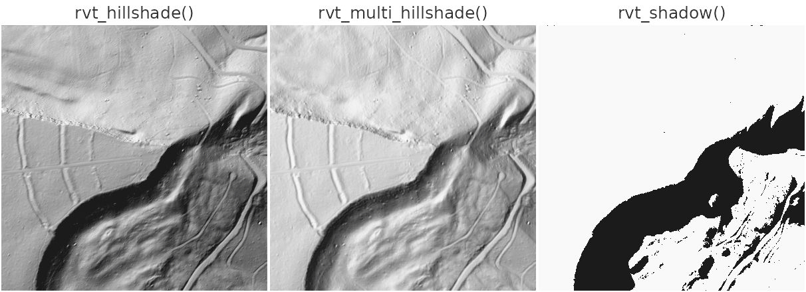

[`rvt_daylight()`](https://wiesehahn.github.io/rvtr/reference/rvt_daylight.md)
and
[`rvt_insolation()`](https://wiesehahn.github.io/rvtr/reference/rvt_insolation.md)
use the real path of the sun through the year instead.
[`rvt_daylight()`](https://wiesehahn.github.io/rvtr/reference/rvt_daylight.md)
counts the hours of direct sun per day, here averaged over a year,
taking both cast shadow and the way each slope faces into account.
[`rvt_insolation()`](https://wiesehahn.github.io/rvtr/reference/rvt_insolation.md)
measures the solar energy received, in kWh/m² per year. Hours and energy
are not the same thing: a slope facing away from the sun can be lit for
many hours at a low angle while receiving little energy.

Both are theoretical. They assume a clear sky, and on a terrain model
they see only the bare ground: this area is wooded, so in reality far
less sun reaches the ground than shown. For the light falling on the
treetops, use a surface model instead.

``` r

rvt_daylight(dem) |>
  rvt_plot("Inferno", main = "rvt_daylight()", max_dim = 400, range = c(5, 12))
rvt_insolation(dem) |>
  rvt_plot("Inferno", main = "rvt_insolation()", max_dim = 400, range = c(600, 2000))
```

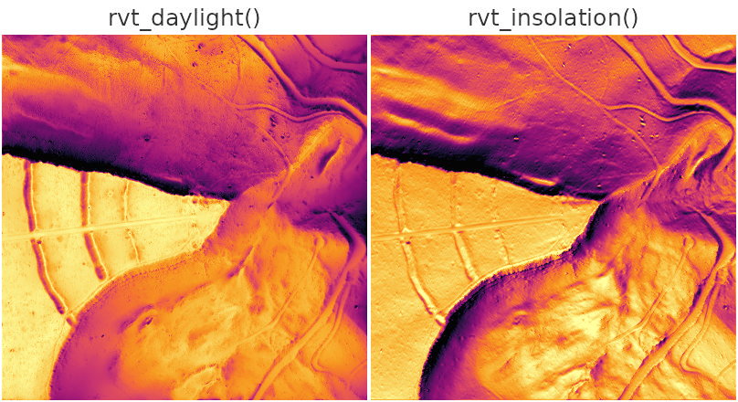

## Sky and horizon

These metrics look along many directions from each cell and find how
high the horizon rises. Nothing is lit from one side, so no feature
disappears in shadow.

[`rvt_svf()`](https://wiesehahn.github.io/rvtr/reference/rvt_svf.md),
the sky-view factor, is the share of the sky visible from each cell: 1
on open flat ground, lower in hollows and at the foot of slopes. It
works like an overcast sky.
[`rvt_asvf()`](https://wiesehahn.github.io/rvtr/reference/rvt_asvf.md)
weights the sky towards one direction, giving a sense of light like a
hillshade while still hiding nothing.
[`rvt_sky_illumination()`](https://wiesehahn.github.io/rvtr/reference/rvt_sky_illumination.md)
models the diffuse light actually received, counting the direction each
slope faces as well as the horizon.

``` r

rvt_svf(dem) |> rvt_plot(main = "rvt_svf()", max_dim = 400, range = c(0.65, 1))
rvt_asvf(dem) |> rvt_plot(main = "rvt_asvf()", max_dim = 400, range = c(0.65, 1))
rvt_sky_illumination(dem) |>
  rvt_plot(main = "rvt_sky_illumination()", max_dim = 400, range = c(0.6, 1))
```

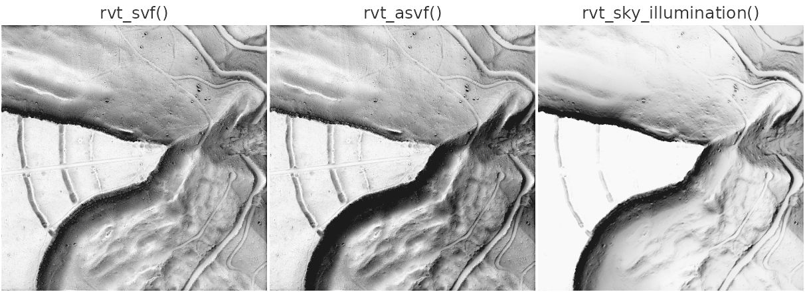

[`rvt_openness()`](https://wiesehahn.github.io/rvtr/reference/rvt_openness.md)
measures the angle of the open sky above each cell, averaged over all
directions, in degrees. Convex features such as banks and edges come out
bright.
[`rvt_openness_negative()`](https://wiesehahn.github.io/rvtr/reference/rvt_openness_negative.md)
does the same for the terrain turned upside down, so ditches, tracks and
hollows come out bright instead.

``` r

rvt_openness(dem) |>
  rvt_plot(main = "rvt_openness()", max_dim = 400, range = c(75, 92))
rvt_openness_negative(dem) |>
  rvt_plot(main = "rvt_openness_negative()", max_dim = 400, range = c(75, 92))
```

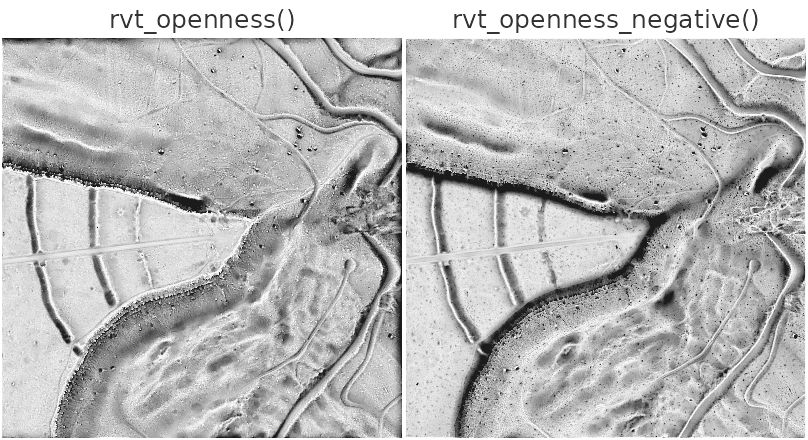

## Local relief

These metrics remove the broad shape of the landscape and keep what
stands above or sinks below it, in metres or in units of local
variation. Signed results read best with a diverging palette and a range
centred on zero; below, red is above the surroundings and blue below
them.

[`rvt_slrm()`](https://wiesehahn.github.io/rvtr/reference/rvt_slrm.md),
the simple local relief model, is each cell’s height above or below the
average of its surroundings, here within 20 m;
[`rvt_tpi()`](https://wiesehahn.github.io/rvtr/reference/rvt_slrm.md) is
the same function under its other common name, the topographic position
index.
[`rvt_msrm()`](https://wiesehahn.github.io/rvtr/reference/rvt_msrm.md)
combines this over a range of scales, so features of different sizes
show at once.
[`rvt_dev()`](https://wiesehahn.github.io/rvtr/reference/rvt_dev.md)
divides the difference by how rough the surroundings are, so a small
bank on smooth ground and a larger one on rough ground read alike.

``` r

rvt_slrm(dem) |>
  rvt_plot("Blue-Red 3", main = "rvt_slrm()", max_dim = 400, range = c(-2, 2))
rvt_msrm(dem) |>
  rvt_plot("Blue-Red 3", main = "rvt_msrm()", max_dim = 400, range = c(-0.5, 0.5))
rvt_dev(dem) |>
  rvt_plot("Blue-Red 3", main = "rvt_dev()", max_dim = 400, range = c(-1, 1))
```

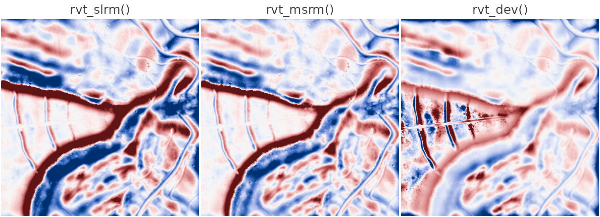

[`rvt_local_dominance()`](https://wiesehahn.github.io/rvtr/reference/rvt_local_dominance.md)
shows how far the surroundings fall away below a cell, which brings out
low, spread-out features.
[`rvt_mstp()`](https://wiesehahn.github.io/rvtr/reference/rvt_mstp.md)
colours each cell by the scale at which it stands out: blue for fine,
green for medium, red for broad features. Its default scales reach
several kilometres, far beyond this square, so the scales here are cut
down to fit.

``` r

rvt_local_dominance(dem) |>
  rvt_plot(main = "rvt_local_dominance()", max_dim = 400, range = c(0.5, 2.5))
rvt_mstp(dem, local = c(3, 21, 2), meso = c(23, 103, 18), broad = c(123, 223, 50)) |>
  rvt_plot(main = "rvt_mstp()", max_dim = 400)
```

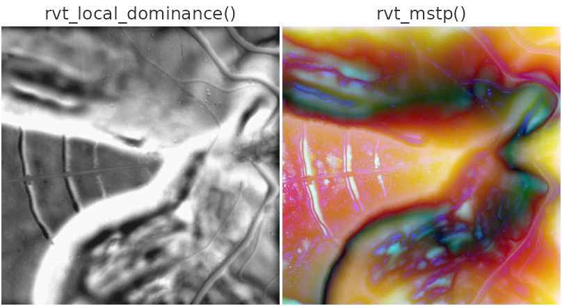

## Surface shape

[`rvt_slope()`](https://wiesehahn.github.io/rvtr/reference/rvt_slope.md)
is steepness in degrees, drawn here with flat ground light and steep
ground dark.
[`rvt_aspect()`](https://wiesehahn.github.io/rvtr/reference/rvt_aspect.md)
is the compass direction each slope faces, from 0 to 360 degrees, so it
needs a palette whose ends meet.
[`rvt_curvature()`](https://wiesehahn.github.io/rvtr/reference/rvt_curvature.md)
is how sharply the ground bends: positive (red) where it is convex, such
as the top of an edge, negative (blue) where it is concave, such as the
foot of a slope. Measured from each cell’s immediate neighbours at 1 m,
it also picks up every small bump, hence the speckled look; the sections
below show what its different types show, and how to measure it at a
broader scale.
[`rvt_log()`](https://wiesehahn.github.io/rvtr/reference/rvt_log.md),
the Laplacian of Gaussian, is curvature with smoothing built in: it
first smooths the ground by `sigma` metres, so edges of that size stand
out and smaller noise does not. Like curvature, it is positive on banks
and edges and negative in ditches and hollows.

``` r

rvt_slope(dem) |>
  rvt_plot(rev(hcl.colors(256, "Grays")), main = "rvt_slope()", max_dim = 400,
           range = c(0, 45))
rvt_aspect(dem) |>
  rvt_plot(rainbow(256), main = "rvt_aspect()", max_dim = 400, range = c(0, 360))
rvt_curvature(dem) |>
  rvt_plot("Blue-Red 3", main = "rvt_curvature()", max_dim = 400,
           range = c(-0.2, 0.2))
rvt_log(dem, sigma = 3) |>
  rvt_plot("Blue-Red 3", main = "rvt_log()", max_dim = 400, range = c(-0.1, 0.1))
```

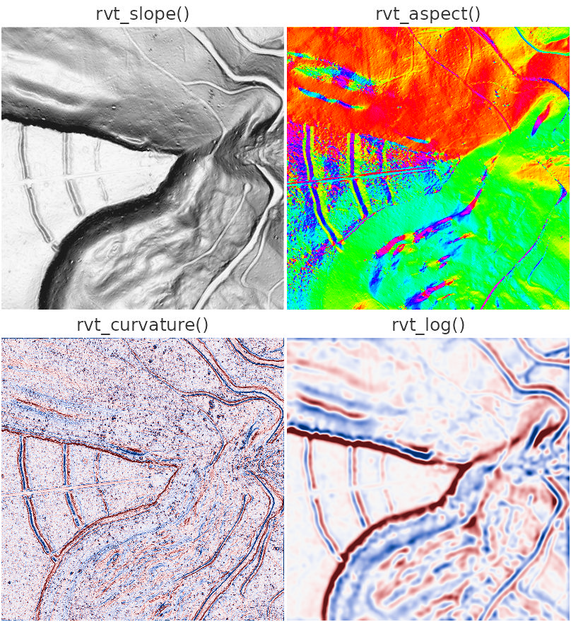

### Landforms

[`rvt_geomorphons()`](https://wiesehahn.github.io/rvtr/reference/rvt_geomorphons.md)
sorts each cell into one of ten landform classes by comparing it with
the terrain along eight directions, up to `reach` metres away. The
classes are listed in `rvt_geomorphon_classes`; the colours below follow
the usual convention, from greys for flat ground and reds for peaks and
ridges through yellows for slopes to greens and blues for hollows,
valleys and pits.

Landforms are a matter of scale. On the 400 m square at 1 m, looking 20
m around, almost everything is slope, with the ditches and parts of the
edge picked out as narrow lines. On the 4 km landscape at 10 m, looking
500 m around, the larger forms appear: level plateaus in grey, their
rims as shoulders, the ridge on which the square lies, and the network
of valleys cut into them. Here ground counts as flat below 3 degrees
rather than the default 1, because the plateau tops are gently tilted.

``` r

classes <- c("#dcdcdc", "#380000", "#c80000", "#ff5014", "#fad23c",
             "#ffff3c", "#b4e614", "#3cfa96", "#0000ff", "#000038")

rvt_geomorphons(dem, reach = 20) |>
  rvt_plot(classes, main = "1 m, reach = 20", max_dim = 400, range = c(1, 10))
rvt_geomorphons(landscape, reach = 500, skip = 20, flat_threshold = 3) |>
  rvt_plot(classes, main = "10 m, reach = 500", max_dim = 400, range = c(1, 10))
outline()

plot.new()
legend("center", legend = names(rvt_geomorphon_classes), fill = classes,
       bty = "n", cex = 1.1)
```

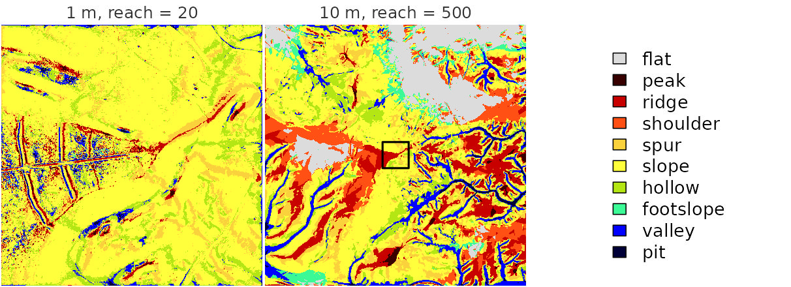

### Types of curvature

“Curvature” covers several different questions about how the ground
bends, and
[`rvt_curvature()`](https://wiesehahn.github.io/rvtr/reference/rvt_curvature.md)
answers 14 of them through `type`. The six below are the ones most often
useful. They are measured over a 3 m window (`radius = 3`) to calm the
noise, and each has its own stretch, because their values differ in
size.

- `profile`, the default, is measured straight down the slope: positive
  where the slope steepens towards the brow of an edge, negative where
  it eases off at its foot. It picks out breaks of slope, such as the
  banks of the ditches.
- `tangential` is measured across the slope, along the contour: positive
  on spurs, where water would spread apart, negative in hollows and
  gullies, where it gathers.
- `mean` averages the bending over every direction, so it shows whether
  the ground bulges outwards or dishes inwards overall.
- `minimal` and `maximal` are the least and the most the ground bends in
  any direction. Along a ditch the ground bends hard across it and
  barely along it, so ditches stand out in `minimal` (blue) and banks
  and edges in `maximal` (red).
- `shape_index` describes the form alone, however gently or sharply the
  ground bends: −1 for a pit, −0.5 a valley, 0 a saddle, +0.5 a ridge
  and +1 a dome. Because intensity is ignored, even the faintest bumps
  on flat ground show, which gives the busy texture.

``` r

types <- c(profile = 0.1, tangential = 0.05, mean = 0.05,
           minimal = 0.1, maximal = 0.1, shape_index = 1)
for (type in names(types)) {
  rvt_curvature(dem, type = type, radius = 3) |>
    rvt_plot("Blue-Red 3", main = type, max_dim = 400,
             range = c(-types[[type]], types[[type]]))
}
```

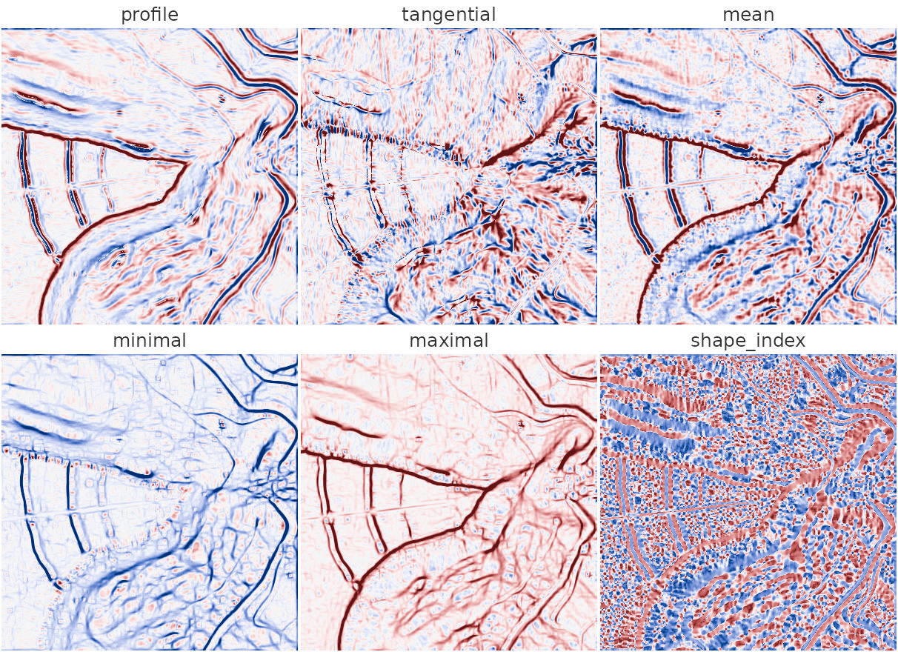

The remaining types, among them `gaussian` (domes and bowls against
saddles), `unsphericity` and `twisting`, are described in
[`?rvt_curvature`](https://wiesehahn.github.io/rvtr/reference/rvt_curvature.md).

## Choosing a scale

Every metric has a scale: the size of the features it responds to, set
by the cell size of the terrain model together with the window or
distance the metric looks at. The same metric at a different scale
answers a different question.

### Local and landscape

Below, curvature is measured over the same window of 7 × 7 cells twice.
On the 400 m square at 1 m (`radius = 3`), the window spans 7 m, and
curvature finds the banks of the ditches, the tracks and the sharp rim
of the edge. On the 4 km landscape at 10 m (`radius = 30`), the window
spans 70 m, and those details are gone: curvature now traces the valleys
cut into the plateaus in blue, with their rims in red. The outline marks
the 400 m square. Values at the landscape scale are ten times smaller,
since curvature is measured per metre, so the stretch differs too.

``` r

rvt_curvature(dem, radius = 3) |>
  rvt_plot("Blue-Red 3", main = "1 m cells, radius = 3", max_dim = 400,
           range = c(-0.1, 0.1))
rvt_curvature(landscape, radius = 30) |>
  rvt_plot("Blue-Red 3", main = "10 m cells, radius = 30", max_dim = 400,
           range = c(-0.008, 0.008))
outline()
```

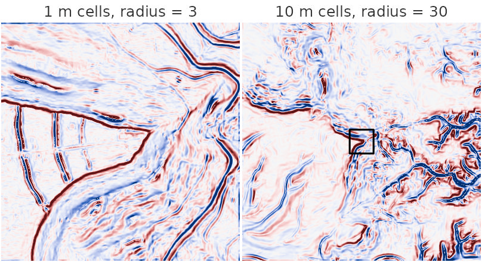

A coarser terrain model is also far quicker to process, so for a
landscape question
[`rvt_resample()`](https://wiesehahn.github.io/rvtr/reference/rvt_resample.md),
or fetching at a coarser `res`, is the efficient route, rather than a
very large window on fine data.

### Window size

Within one terrain model, `radius` sets the size of the surroundings a
cell is compared with. The local relief models show this well. A small
`radius` picks out tracks, ditches and single mounds; a large one shows
whole slopes and edges:

``` r

rvt_slrm(dem, radius = 5) |>
  rvt_plot("Blue-Red 3", main = "rvt_slrm(radius = 5)", max_dim = 400,
           range = c(-0.5, 0.5))
rvt_slrm(dem, radius = 30) |>
  rvt_plot("Blue-Red 3", main = "rvt_slrm(radius = 30)", max_dim = 400,
           range = c(-4, 4))
```

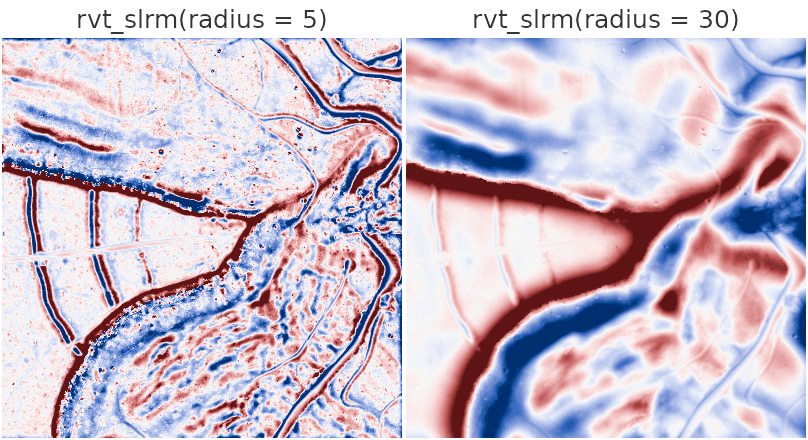

### How far to look

The sky and horizon metrics, and the sun metrics, have `reach` instead:
how far they look for the horizon, in metres. A short reach shows small
features close by; a long reach adds the shape of the wider landscape:
the lower ground below the edge and in the east darkens, because the
higher ground around it closes off the horizon. A long reach stays
affordable, because distant terrain is read from coarser copies of the
terrain model;
[`?rvt_reach`](https://wiesehahn.github.io/rvtr/reference/rvt_reach.md)
explains how.

``` r

rvt_openness(dem, reach = 10) |>
  rvt_plot(main = "rvt_openness(reach = 10)", max_dim = 400, range = c(75, 92))
rvt_openness(dem, reach = 100) |>
  rvt_plot(main = "rvt_openness(reach = 100)", max_dim = 400, range = c(70, 90))
```

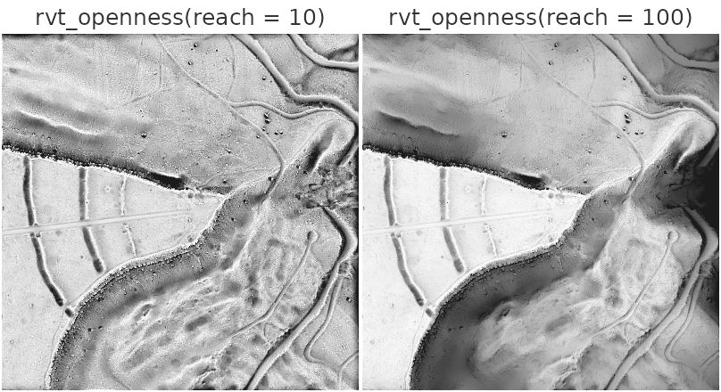

## Composites

No single metric shows everything, and they combine well.
[`rvt_vat()`](https://wiesehahn.github.io/rvtr/reference/rvt_vat.md)
builds a ready-made composite from a hillshade, slope, openness and
sky-view factor, and
[`rvt_blend()`](https://wiesehahn.github.io/rvtr/reference/rvt_blend.md)
lets you build your own; the [blending
vignette](https://wiesehahn.github.io/rvtr/articles/blending.md) covers
both.
